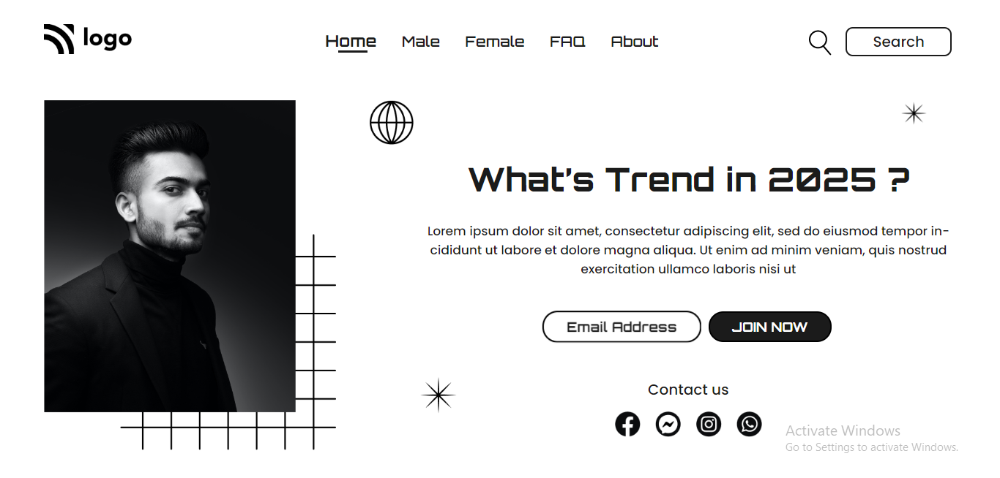

# Portfolio Project 1

## Description

This project is a landing page for a hair salon. It is built using `HTML` and `CSS`.

### Learnings from this project -

- How to create a navigation bar
- How to position elements in a web page
- How to use CSS `animation` property
- How to create `buttons` and add animations to them
- How to use CSS `z-index` property

### Preview of the project

### [Live link](https://portfolio-project-1-two.vercel.app) of the project.
